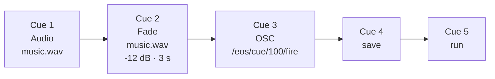

# Quickstart — your first show in five minutes

By the end of this page you'll have a working five-cue show with
audio, a fade, and an OSC trigger to an external system. If you
just want the punchlist:

1. Launch quewi → **Create new show**
2. Press <kbd>A</kbd>, point at an audio file
3. Press <kbd>F</kbd>, set duration to 3 s
4. Press <kbd>O</kbd>, fill in an OSC address
5. Press <kbd>Space</kbd>

Read on for the explanation behind each step.

---

## 0. Launch quewi

The welcome window opens whenever you have no show loaded. Pick
**Create new show** — quewi opens an empty workspace with one
cue list called "Main".

The main window has four regions:

| Region | What it is |
|---|---|
| Top toolbar | Cue creation buttons + the active cue list tabs |
| Left/centre | The cue list itself |
| Right | The Inspector — edits the selected cue's properties |
| Bottom | Transport bar (GO / Pause / Fade All / Panic) + active-cues strip |

If the Inspector feels cramped, drag the splitter between it and
the cue list. The Inspector is also dockable — drag its title bar
out to float it on a second monitor.

---

## 1. Add an Audio cue

Press <kbd>A</kbd> (the keyboard shortcut for "new Audio cue").
A new row appears in the list, selected, with the Inspector now
showing audio-specific controls.

In the Inspector:

- **File** — click **Browse** and pick a `.wav`, `.mp3`, `.flac`,
  `.ogg`, `.aac`, `.m4a`, or any other format Qt Multimedia /
  FFmpeg supports.
- **Name** — gets auto-set to the filename; edit it to whatever
  reads well in your cue list ("Overture", "Bird outside").

Try it: select the new cue and press <kbd>Space</kbd>. The cue
fires; you should hear audio play through your default output
device. The cue list row turns green and the bottom **ACTIVE**
strip shows a scrubbable progress bar, level meters, and a Stop
button. Click anywhere on the progress bar to seek inside the
playing voice.

---

## 2. Add a Fade cue

Press <kbd>F</kbd>. A Fade cue appears. In the Inspector:

- **Target** — pick the Audio cue you just added from the
  dropdown.
- **Parameter** — leave on `gainDb`.
- **Target value** — `-INF` (full silence) or `-12` (12 dB down).
- **Duration** — `3` seconds.

Fade cues animate a parameter on another cue. With the audio
playing, fire the fade (select it + <kbd>Space</kbd>) — the
audio level smoothly fades over three seconds.

!!! tip "Fades work on any numeric field"
    The Inspector lists every fadeable parameter in the dropdown.
    Fade `pan` for a stereo sweep, fade `opacity` on a Video cue,
    fade individual DMX channels via a Light Fade cue.

---

## 3. Add an OSC cue

Press <kbd>O</kbd>. An OSC cue appears. In the Inspector:

- **Host** — the destination machine's IP, e.g. `192.168.1.20`
  (or `127.0.0.1` for local testing).
- **Port** — typically `8000` or `53000`.
- **Transport** — UDP (default) is right 99% of the time.
- **Address** — the OSC path, e.g. `/cue/1/start` or
  `/eos/cue/100/fire`.
- **Args** — comma-separated arguments. Plain numbers become
  ints/floats automatically; quoted strings become strings;
  `true`/`false`/`nil`/`inf` become typed OSC tags.

Quewi's [OSC monitor window](../using-quewi/cue-types.md) (Tools
menu) is the easiest way to test this — point the OSC cue at
your own machine on the port the monitor is listening on, fire
the cue, and watch the message arrive.

---

## 4. Save the show

<kbd>Ctrl/Cmd</kbd>+<kbd>S</kbd>. Pick a folder and a name
ending in `.quewi`. The file is a small SQLite database — fast
to load, version-controllable, and the file format spec is
documented in [reference](../reference/file-format.md) if you
need to inspect it.

---

## 5. Run the show

Press <kbd>Space</kbd> with no cue specifically selected — quewi
starts at the top and walks through. Press <kbd>Space</kbd>
again for the next cue, and so on. The next-up cue is shown in
the transport bar; you always know what GO will do.

While the show runs:

| Action | Key |
|---|---|
| Fire next cue | <kbd>Space</kbd> |
| Pause every audio voice (resumable) | <kbd>Mod</kbd>+<kbd>.</kbd> |
| Fade everything out over 2 seconds | <kbd>Mod</kbd>+<kbd>Shift</kbd>+<kbd>.</kbd> |
| Hard stop everything immediately | <kbd>Esc</kbd> |

When the show is about to start for real, flip **Show Mode** on
(<kbd>Mod</kbd>+<kbd>Shift</kbd>+<kbd>L</kbd>) — the UI locks
down so a stray click can't reorder or delete a cue.

---

## What you just built

This is the smallest interesting quewi show. Add a Light cue and
a Video cue and you've covered the four output domains
(audio / OSC / DMX / video) — that's the whole feature surface,
in five clicks.

---

## Next steps

- [Concepts](concepts.md) — what a cue actually is, how GO
  navigates, why pre-flight exists.
- [Cue types overview](../using-quewi/cue-types.md) — every cue
  type and what it's for.
- [Keyboard shortcuts](../using-quewi/shortcuts.md) — every chord
  the app ships with.
