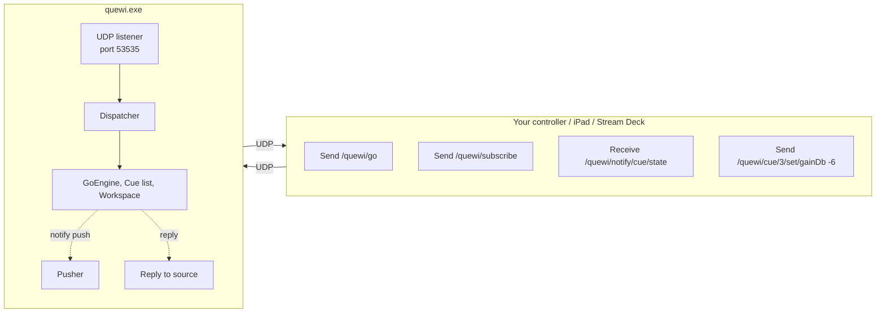

# OSC remote control — overview

Every important action in quewi is reachable over OSC. Fire cues,
edit fields, mirror state, swap cue lists, undo, save the workspace.
The four pages in this section cover:

- **Overview** (you're here) — what it's for, who uses it
- [**Address reference**](reference.md) — every `/quewi/...`
  message the app responds to or pushes
- [**Per-cue field reference**](field-reference.md) — every
  field of every cue type that's editable over OSC
- [**Recipes**](recipes.md) — Python / Companion / Stream Deck
  examples

---

## What's it for?

Three audiences, three reasons.

**1. Stage manager with a tablet or phone**

> "I want to advance cues from the catwalk during tech, not have
> to walk back to the booth every time."

A simple OSC client on a tablet (TouchOSC, OSC/PILOT, or a
custom layout) sending `/quewi/go`, `/quewi/cue/select`,
`/quewi/panic`. Buy you the freedom to be where the show needs
you.

**2. Hardware controller / Stream Deck**

> "I want a row of buttons on my desk that map to specific cues."

Companion (Bitfocus) modules, Stream Deck plugins, X-Keys boxes,
APC mini grids — anything that can send a UDP OSC message can
fire a quewi cue. Map a button to `/quewi/cue/start 12.5` and
button-press = cue 12.5 fires.

**3. Custom controller / integration**

> "I want quewi to integrate with my custom lighting console / my
> in-house show-running automation / my Eos macro."

Quewi exposes the whole API. Mirror the cue list in your custom
UI (subscribe to push notifications). Build cues from your own
authoring tool and inject them with `/quewi/cue/add`. Query the
workspace state to drive your own display.

---

## Architecture in one diagram

One UDP socket per side. Quewi reads the source port of every
inbound message and replies / pushes back to it. Your client
needs to keep one socket open in both directions.

---

## Transports

Quewi can listen on three transports:

| Transport | Default port | When to use |
|---|---|---|
| **UDP** | 53535 | Default. Fast, fire-and-forget. Right for triggers + low-latency control. |
| **TCP / SLIP** | 53536 | When you need delivery guarantees (no UDP packet loss). OSC 1.1 over SLIP framing. |
| **WebSocket** | 53537 | When the controller is a browser. Quewi runs a small WS server; messages are OSC bundles over WS frames. |

Enable TCP and WS in Preferences → OSC → **Advanced**. They're off
by default because most rigs only need UDP.

---

## Discovery

Quewi doesn't currently advertise itself over Bonjour / mDNS —
controllers need to be told the IP. That's on the post-1.0
roadmap. For now:

- Find quewi's IP: Preferences → OSC shows the listen address.
- Hard-code it in the controller, OR
- Let the controller send `/quewi/heartbeat` to a broadcast
  address (`255.255.255.255`) on the listen port; quewi will
  receive it and the controller can then read the source IP
  on the reply. (Crude but works.)

---

## Security

Quewi binds UDP on **all IPv4 interfaces** (`0.0.0.0`) so anyone
on the same network can reach it. For real shows:

- **Use a wired backstage network**, not the venue's public Wi-Fi.
- **Firewall the OSC port** to only your control surface's IP if
  you're on shared Wi-Fi.
- **The OSC API is NOT authenticated** — anyone who can reach
  the port can fire any cue, edit any field, save the workspace
  over your show. Treat it like an open MIDI port: keep it
  behind your network's perimeter.

---

## Next steps

- [Address reference](reference.md) — the full list of `/quewi/...`
  addresses
- [Field reference](field-reference.md) — what to send when editing
  cues
- [Recipes](recipes.md) — copy-paste examples for common patterns
