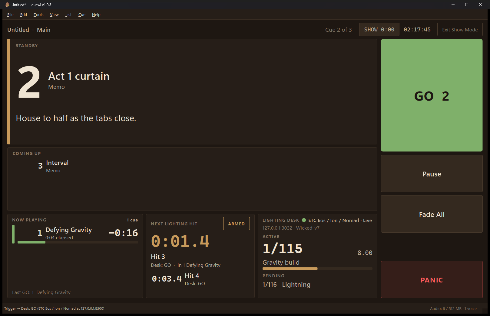

# Show Mode

Show Mode is for running the show. The window switches to a **stage
manager screen** that shows what's on standby, what's playing, what the
lighting desk is doing and the next lighting hit, with big GO, Pause,
Fade All and Panic buttons. Editing is locked, so a stray key or a
dropped file can't change the show.

---

## Turning it on

- **Menu**: Tools → Show Mode (locked)
- **Keyboard**: <kbd>Mod</kbd>+<kbd>Shift</kbd>+<kbd>L</kbd>
- **Automatically**: Preferences → Show Mode → "Enter Show Mode
  automatically when opening a show"

To leave, press **Exit Show Mode** at the top right (or the same menu
item or keys). With an unlock PIN set, quewi asks for it first.

---

## The stage manager screen

*New in 1.0.4.*

{ loading=lazy }

| Area | Shows |
|---|---|
| **Header** | The show and cue list, **Cue 12 of 40**, a **SHOW** stopwatch (click to start or pause, right-click to reset) and the time of day. |
| **STANDBY** | What the next GO fires: its number (the biggest thing on screen), name, type, length, pre-wait, AUTO-CONTINUE / AUTO-FOLLOW, and its **notes** in large type, so the cue's notes can hold the standby call. A song with lighting triggers says how many there are and when the first one comes ("3 lighting hits · first 0:04 after GO"). The cue's colour runs down the left edge. At the end of the list it says so and GO is greyed out. |
| **COMING UP** | The next few cues after standby, with a line of their notes. |
| **NOW PLAYING** | Every song playing: elapsed, a big **time remaining**, a progress bar, and PAUSED / looping. The last GO is at the bottom. |
| **NEXT LIGHTING HIT** | A countdown to the next lighting trigger in any playing song (for example **0:03.2**), what it will do on the desk ("Desk: GO"), and which song it's in, then the few after it. The **ARMED** chip turns lighting triggers on and off. Paused songs freeze their countdowns; disarmed, it says nothing will be sent. |
| **LIGHTING DESK** | What the desk itself is doing (ETC Eos family only, see [Reading the desk back](lighting-triggers.md#reading-the-desk-back)): its **ACTIVE** cue with label, time and progress, its **PENDING** cue, its show name, and a warning when the desk is in Blind. |
| **Transport** | **GO** (it shows the standby number, for example "GO 12"), **Pause** (it turns into **Resume**), **Fade All**, and **PANIC** at the bottom, set apart so it isn't hit by mistake. |

The keyboard works as always: <kbd>Space</kbd> is GO and <kbd>Esc</kbd>
is Panic, wherever you click on the screen.

The Inspector and the Lighting panel step aside while the screen is up
and come back when you leave Show Mode.

!!! tip "Prefer the cue list?"
    Preferences → Show Mode → untick **Use the stage manager screen**.
    Show Mode then keeps the normal window, locked, with a banner across
    the top.

---

## What gets locked

| Capability | In Edit Mode | In Show Mode |
|---|---|---|
| **GO** | ✅ | ✅ |
| **Pause / Fade All / Panic** | ✅ | ✅ |
| **Select cue (mouse, arrow keys)** | ✅ | ✅ |
| **Copy a cue** (read-only inspection) | ✅ | ✅ |
| Edit a field in the Inspector | ✅ | ❌ |
| Cut / paste / duplicate / delete | ✅ | ❌ |
| Drag to reorder cues | ✅ | ❌ |
| Drop a file on the cue list to add it | ✅ | ❌ |
| Drop a file on the window | ✅ | ❌ |
| Right-click context menu | ✅ | ❌ |
| File / Edit / Cue / List menus | ✅ | ❌ |
| New cue (single-key shortcuts) | ✅ | ❌ |
| Undo / redo | ✅ | ❌ |

The lock is genuinely enforced — not just visual. The cue list
swallows edit shortcuts, the right-click menu is suppressed,
drag-reorder is disabled (it doesn't even trigger the indicator),
external file drops are silently rejected with a status bar
nudge.

---

## Unlock PIN

Set an **Unlock PIN** in Preferences → Show Mode to require it to *leave*
Show Mode. Entering Show Mode is still a single keystroke.

Use case: backstage. Stage manager presses GO, occasionally hits
weird key combos by accident. Without a password, a stray
<kbd>Ctrl</kbd>+<kbd>Shift</kbd>+<kbd>L</kbd> drops them back
into edit. With a password, that keystroke prompts for the
code; misfire = nothing happens.

The password is stored hashed (SHA-256) in QSettings. There's no
recovery — if you forget it, delete the `showMode/passwordHash`
key in your settings file:

=== "Windows"
    Registry: `HKCU\Software\ServeGaming\quewi\showMode\passwordHash`

=== "macOS"
    `~/Library/Preferences/com.ServeGaming.quewi.plist`

=== "Linux"
    `~/.config/ServeGaming/quewi.conf`

---

## When to flip it on

Best practice:

1. **Pre-flight passes** — run [pre-flight](preflight.md), green-light it.
2. **Operator is at the desk** — they know they're driving the show.
3. **Flip Show Mode on** — at fifteen minutes to house open, or
   whenever the cueing edits are settled.
4. **Run the show** — GO, GO, GO, Pause for intermission, GO, …
5. **Flip Show Mode off** when the show's over — for the post-show
   notes pass.

If you find yourself toggling Show Mode mid-show to fix a typo,
something's wrong with the cue list. Stop the show first
(<kbd>Esc</kbd>), fix it, run the relevant section of cues
in rehearsal again, then resume.

---

## Show Mode vs the "armed" flag

Both prevent accidental cue execution, but they're different
mechanisms:

- **Armed flag**: per-cue. An unarmed cue is skipped on GO. Use
  for cues that depend on a conditional ("only fire the bird-call
  cue if the kids' choir is on stage today").
- **Show Mode**: workspace-wide. Prevents *editing*, not firing.
  GO fires everything armed.

You can absolutely toggle armed flags during a show — the cue
list still selects, you can still see the inspector (read-only),
and the **Arm/Disarm** action (<kbd>A</kbd> in the cue list)
toggles the armed state without entering an editing dialog.

Wait, no — Arm/Disarm is an edit action and IS blocked in Show
Mode. If you need to disarm mid-show, you'll need to leave Show
Mode, toggle, re-enter.

---

## Limitations

- **The OSC remote API is NOT locked by Show Mode.** A controller
  with quewi's address can still send `/quewi/cue/add` or
  `/quewi/undo` while quewi-the-app is in Show Mode. The lock is
  for the operator at the local keyboard, not for the network.
  This is by design — backstage controllers running cues are
  expected to be trusted devices.
- **Auto-recovery from journal is NOT prevented.** If quewi crashes
  mid-show, the recovery dialog on next launch is editable.
  Show Mode resets on relaunch.
